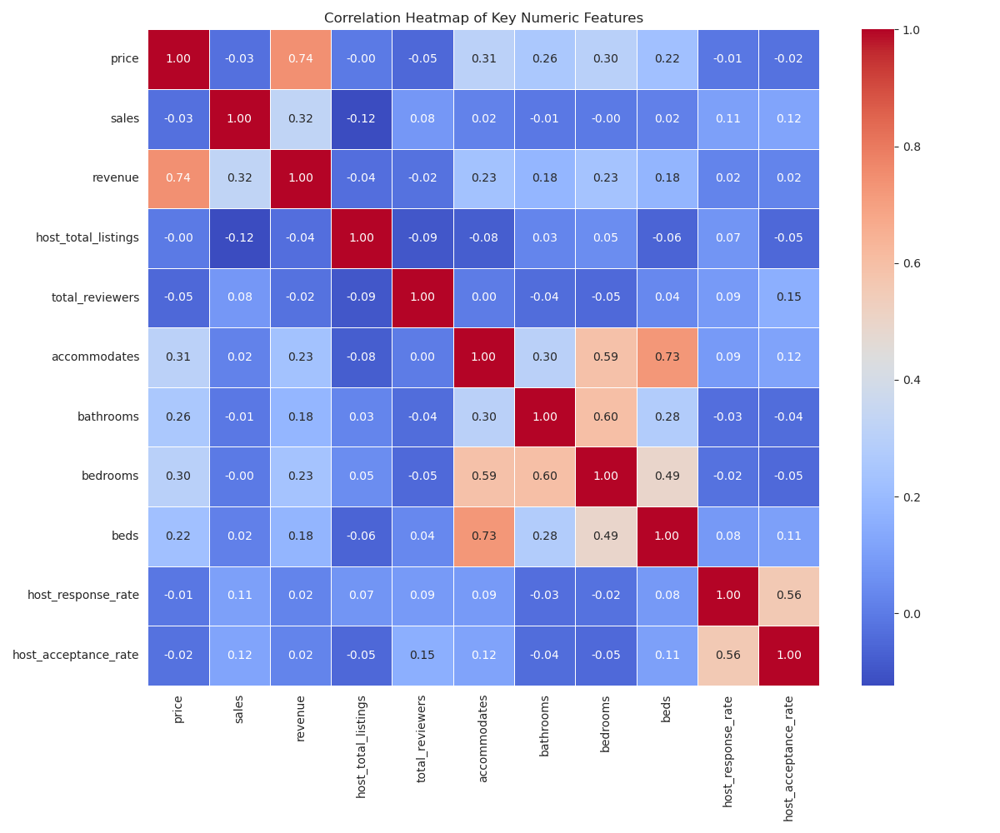

# Airbnb Pricing Strategy Analysis 📈

This project analyzes a cleaned Airbnb dataset to identify key metrics that impact listing prices and total revenue. The goal of this project is to understand the key factors drivering revenue and provide insights for hosts to optimize their pricing strategy.

This analysis is part of a project on Airbnb pricing strategy to optimise factors affecting pricing and maximizing revenue. The main Python script (`analysis.py`) performs data loading, feature engineering (creating a `revenue` column), and generates a series of visualizations to uncover key relationships.

---

## 🚀 How to Run This Project

To replicate this analysis, follow these steps:

1.  **Clone the Repository**
    ```bash
    git clone [https://github.com/Utkarsh-D-Ingle/Airbnb-pricing-analysis.git](https://github.com/Utkarsh-D-Ingle/Airbnb-pricing-analysis.git)
    cd Airbnb-pricing-analysis
    ```

2.  **Install Dependencies**
    This project requires `pandas`, `statsmodels` `matplotlib`, and `seaborn`.
    ```bash
    pip install pandas matplotlib seaborn statsmodels
    ```

3.  **Run the Analysis**
    Execute the Python script to generate all the plots.
    ```bash
    python reports.py
    ```

---

## 🔑 Key Files

* `reports.py`: The main Python script containing all the analysis and visualization code.
* * `data_cleaner.py`: The Python script containing code for cleaning raw csv file(Airbnb_data.csv).
* `Airbnb_data_cleaned.csv`: The cleaned dataset used for this analysis.
* `*.png`: All the plots and charts generated by the analysis script.

---

## 📊 Key Findings & Visualizations

### 1. What Drives Price and Revenue?
The correlation heatmap shows that `accommodates`, `bathrooms`, and `bedrooms` are strongly and positively correlated with both `price` and `revenue`. This confirms that **incrementing these properties generate significantly more revenue**.



### 2. The Value of Being a "Guest Favourite"
There is a clear and significant financial benefit to being a "Guest Favourite." On average, these listings earn substantially more revenue, highlighting the importance of investing in guest experience and quality.

### 3. Finding the Revenue "Sweet Spot"
This project's core goal is to find the optimal price.
* **Demand Curve (Price vs. Sales)**: As expected, as `price` increases, the number of `sales` (bookings) tends to decrease.
* **Revenue Optimization Curve (Price vs. Revenue)**: This plot shows the relationship between price and total revenue. The red trendline illustrates that while revenue initially rises with price, it eventually flattens and will fall. **The peak of this curve represents the optimal price point that maximizes total revenue.**
